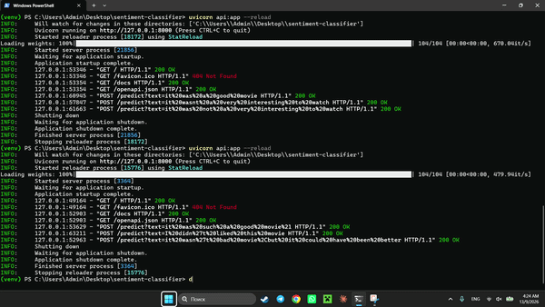

# Sentiment Classifier - Fine-tuned DistilBERT

A sentiment analysis model fine-tuned on the IMDb dataset, served through a FastAPI backend.

## Demo

The API loads the fine-tuned model locally and classifies text as positive or negative in real time.

## Training details

- Base model: `distilbert-base-uncased`
- Dataset: IMDb (`stanfordnlp/imdb`), 3,000 training reviews / 1,000 test reviews
- Epochs: 2
- Batch size: 16
- Max sequence length: 256
- Training environment: Google Colab (T4 GPU)

## Results

| Epoch | Accuracy | F1 Score |
|---|---|---|
| 1 (best checkpoint, used as final model) | 85.9% | 0.866 |
| 2 | 87.3% | 0.873 |

The epoch 1 checkpoint was selected as the final model.

## Model

The trained model is hosted on HuggingFace Hub: [Zolotouly/sentiment-classifier-model](https://huggingface.co/Zolotouly/sentiment-classifier-model)

## Deployment note

This API runs locally rather than as a public hosted endpoint. HuggingFace's free serverless Inference API doesn't support custom fine-tuned models, and free-tier cloud hosts (e.g. Render) hit memory limits when loading the full model with its dependencies. The GIF above shows the API running and serving live predictions locally.

## Running it yourself

\`\`\`

git clone https://github.com/AlibekBerik/sentiment-classifier
cd sentiment-classifier
pip install -r requirements.txt
uvicorn api:app --reload

\`\`\`

Then open `http://127.0.0.1:8000/docs` to test the `/predict` endpoint.

## Tech stack

- PyTorch, HuggingFace Transformers (fine-tuning)
- FastAPI (serving)
- HuggingFace Hub (model hosting)
